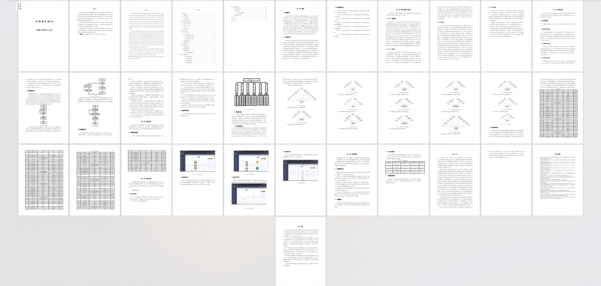
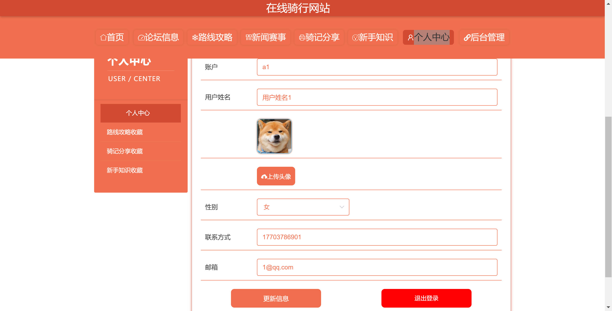
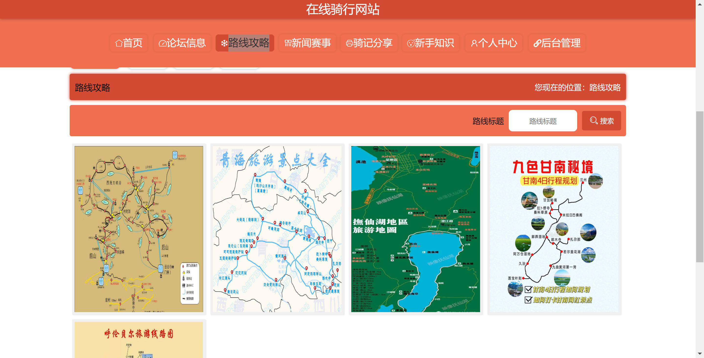
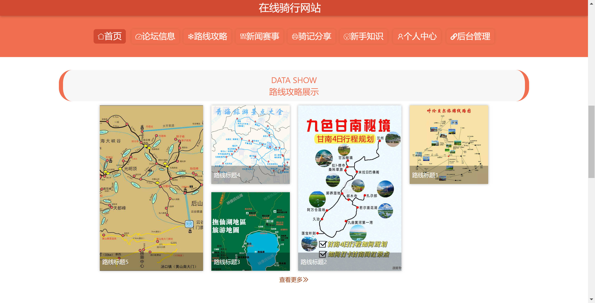
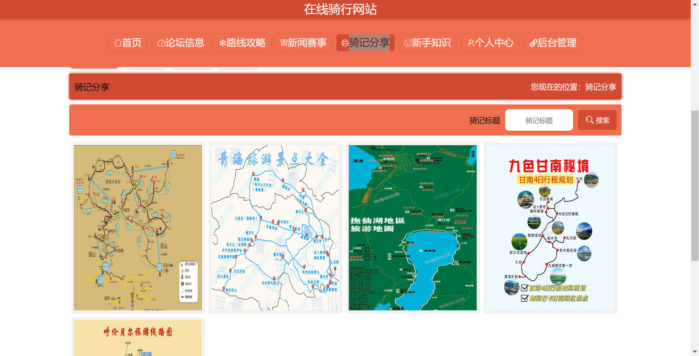
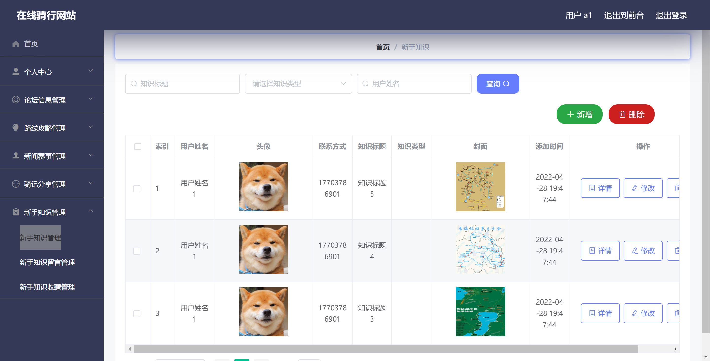
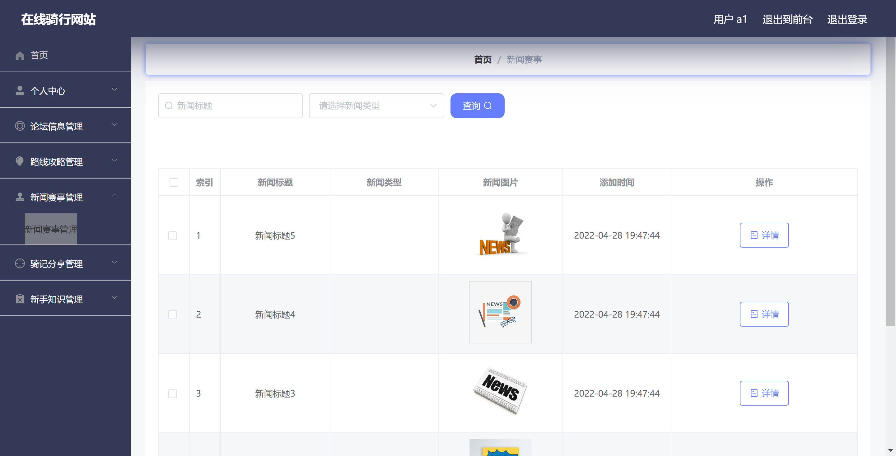

基于Springboot的在线骑行网站系统（程序+论文）
=

### 完整代码获取地址：从戎源码网 ([https://armycodes.com/](https://armycodes.com/))
### 作者微信：19941326836  QQ：952045282 
### 承接计算机毕业设计、Java毕业设计、Python毕业设计、深度学习、机器学习
### 选题+开题报告+任务书+程序定制+安装调试+论文+答辩ppt 一条龙服务
### 所有选题地址https://github.com/nature924/allProject

一、项目介绍
---

基于 Spring Boot 的在线骑行网站系统，系统角色为 管理员 与 普通用户（用户/游客），主要功能如下

管理员：
基本操作：登录、修改密码、获取/修改个人信息
用户管理：筛选用户、查看用户详情、新增/修改/删除用户、获取在线状态
资讯管理（News）：后台列表、详情、新增、修改、删除、批量导入、前端列表/详情控制
路线攻略管理（Luxian）：后台列表、详情、新增、修改、删除、批量导入、前端列表/详情控制
骑记分享管理（Qijiriji）：后台 & 前端 CRUD、批量导入、收藏管理
新手知识管理（Xinshouzhishi）：后台 & 前端 CRUD、收藏管理
论坛管理（Forum）：帖子发布/管理、回复/父子帖子处理、状态审核
收藏/留言管理（Collection / Liuyan）：查看与管理用户收藏与留言

普通用户（用户/游客）：
基本操作：注册、登录、修改密码、获取/修改个人信息
内容浏览：查看新闻、路线、骑记、新手知识、论坛列表与详情（公开接口）
内容操作：发布骑记/路线/帖子（需登录）、编辑/删除自己的内容
互动功能：对文章/路线/骑记进行收藏，发布留言/回复

二、项目技术
---
- 编程语言：Java
- 数据库：MySQL
- 项目架构：B/S架构
- 前端技术：JSP
- 后端技术：Spring、SpringMVC、MyBatis

三、运行环境
---
- 操作系统：Windows、macOS都可以
- JDK版本：JDK1.8以上都可以
- 开发工具：IDEA、Ecplise、Myecplise都可以
- 数据库: MySQL5.7以上都可以
- Tomcat：任意版本都可以
- Maven：任意版本都可以

四、运行截图
---
### 论文截图：

### 程序截图：

